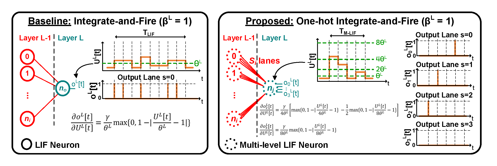

# One-Hot Multi-Level Leaky Integrate-and-Fire Spiking Neural Networks for Enhanced Accuracy-Latency Tradeoff
An official implementation of [One-Hot Multi-Level Leaky Integrate-and-Fire Spiking Neural Networks for Enhanced Accuracy-Latency Tradeoff (IEEE Access 2025)]().

## Summary

 

This work leverages an additional dimension to enhance the accuracy-energy tradeoff space using a one-hot multi-level leaky integrate-and-fire (M-LIF) neuron model. The proposed one-hot M-LIF model represents the inputs and outputs of hidden layers as a set of one-hot binary-weighted spike lanes to find better tradeoff points while still being able to model conventional SNNs. For image classification on static datasets, we demonstrate one-hot M-LIF SNNs outperform iso-architecture conventional LIF SNNs in terms of accuracy (2% higher than VGG16 SNN on ImageNet) while still being energy-efficient (20x lower energy than VGG16 ANN on ImageNet). For dynamic vision datasets, we demonstrate the ability of M-LIF SNNs to reduce latency by 3x compared to conventional LIF SNNs while limiting accuracy degradation (<1%).

## Dependencies

```python3
tqdm==4.64.1
timm == 0.6.12
1.10.0 <= pytorch < 2.0.0
cupy-cuda11x==13.3.0
spikingjelly == 0.0.0.0.12
tensorboard
```

## Data Preparation 

### CIFAR

We use CIFAR10/100 datasets to train and evaluate our models. You can use our scripts to download them automatically or manually download them [here](https://www.cs.toronto.edu/~kriz/cifar.html).

### ImageNet

We employ ImageNet dataset to train and evaluate our models using the following folder structure. The dataset can be extracted using [this script](https://gist.github.com/BIGBALLON/8a71d225eff18d88e469e6ea9b39cef4)

### DVS-CIFAR

We employ the DVS-CIFAR10 dataset to train and evaluate our models in `./neuromorphic_tasks`. For preparation under `./neuromorphic_tasks/data`, please refer to the steps below:   
 - Download and extract the dataset under `neuromorphic_tasks/data/dvs-cifar10` from [here](https://drive.google.com/file/d/1s2csG5eagX3ZMfFpZCd5d7g8zqJxht4U/view).
 - Follow pre-preparation steps as described [here](https://github.com/aa-samad/conv_snn):
     - Use `test_dvs.m` in MATLAB to convert events into matrix (make sure to adjust the folder addresses inside `test_dvs.m`).
     - Run `python3 dvscifar_dataloader.py` to prepare the dataset.

## Train

### VGG16 & ResNet20

Based off of [IIR-SNN repository](https://github.com/SayeedChowdhury/IIR-SNN) and modified for M-LIF integration and training.

#### ANN

Train ANN using `ann_ddp.py` for pre-initializing LQ-ANNs and SNNs.

```python3
# RESNET20, CIFAR10
python3 ann_ddp.py --print_freq 10 --dataset CIFAR10 --batch_size 32 --workers 4 --architecture RESNET20 --learning_rate 0.01 --lr_interval '0.4 0.6 0.8' --lr_reduce 10 --epochs 300 --optimizer SGD --dropout 0 --momentum 0.9 --weight_decay 5e-4 --dataset_dir='./ILSVRC/Data/CLS-LOC' --multiprocessing_distributed --bn --bias

# RESNET20, CIFAR100
python3 ann_ddp.py --print_freq 10 --dataset CIFAR100 --batch_size 64 --workers 4 --architecture RESNET20 --learning_rate 0.01 --lr_interval '0.4 0.6 0.8' --lr_reduce 10 --epochs 300 --optimizer SGD --dropout 0 --momentum 0.95 --weight_decay 5e-4 --dataset_dir='./ILSVRC/Data/CLS-LOC' --multiprocessing_distributed --bn --bias

# VGG16, CIFAR10
python3 ann_ddp.py --print_freq 10 --dataset CIFAR10 --batch_size 16 --workers 4 --architecture VGG16 --learning_rate 0.01 --lr_interval '0.6 0.8 0.9' --lr_reduce 10 --epochs 1200 --optimizer SGD --dropout 0 --momentum 0.95 --weight_decay 5e-4 --dataset_dir='./ILSVRC/Data/CLS-LOC' --multiprocessing_distributed --bn --bias

# VGG16, CIFAR100
python3 ann_ddp.py --print_freq 10 --dataset CIFAR100 --batch_size 32 --workers 4 --architecture VGG16 --learning_rate 0.01 --lr_interval '0.6 0.8 0.9' --lr_reduce 10 --epochs 300 --optimizer SGD --dropout 0 --momentum 0.9 --weight_decay 5e-4 --dataset_dir='./ILSVRC/Data/CLS-LOC' --multiprocessing_distributed --bn --bias

# VGG16, IMAGENET
python3 ann_ddp.py --print_freq 10 --dataset IMAGENET --batch_size 128 --workers 4 --architecture VGG16 --learning_rate 0.01 --lr_interval '0.45 0.7 0.9' --lr_reduce 5 --epochs 90 --optimizer SGD --dropout 0 --momentum 0.9 --weight_decay 5e-4 --dataset_dir='./ILSVRC/Data/CLS-LOC' --multiprocessing_distributed --bn --bias
```

#### LQ-ANN

Train LQ-ANN using `ann_ddp.py` by including the `quant_act` argmument and providing the pre-trained ANN checkpoint path in the `pretrained_ann` argument.

```python3
# RESNET20, CIFAR10
python3 ann_ddp.py --print_freq 10 --dataset CIFAR10 --batch_size 32 --workers 4 --architecture RESNET20 --learning_rate 0.0001 --lr_interval '0.4 0.6 0.8' --lr_reduce 5 --epochs 50 --optimizer 'Adam' --dropout 0 --momentum 0.95 --weight_decay 5e-4 --dataset_dir='./ILSVRC/Data/CLS-LOC' --multiprocessing_distributed --bn --bias --quant_act --act_bits 2 --quant_scale_max 99.7 --quant_num_batches 16 --quant_id 'log' --pretrained_ann './trained_models/ann/ann_resnet20_cifar10.pth'
python3 ann_ddp.py --print_freq 10 --dataset CIFAR10 --batch_size 32 --workers 4 --architecture RESNET20 --learning_rate 0.0001 --lr_interval '0.4 0.6 0.8' --lr_reduce 5 --epochs 50 --optimizer 'Adam' --dropout 0 --momentum 0.95 --weight_decay 5e-4 --dataset_dir='./ILSVRC/Data/CLS-LOC' --multiprocessing_distributed --bn --bias --quant_act --act_bits 3 --quant_scale_max 99.7 --quant_num_batches 16 --quant_id 'log' --pretrained_ann './trained_models/ann/ann_resnet20_cifar10.pth'

# VGG16, CIFAR100
python3 ann_ddp.py --print_freq 10 --dataset CIFAR100 --batch_size 256 --workers 4 --architecture VGG16 --learning_rate 0.0001 --lr_interval '0.4 0.6 0.8' --lr_reduce 5 --epochs 50 --optimizer 'Adam' --dropout 0 --momentum 0.9 --weight_decay 5e-4 --dataset_dir='./ILSVRC/Data/CLS-LOC' --multiprocessing_distributed --bn --bias --quant_act --act_bits 2 --quant_scale_max 99.7 --quant_num_batches 4 --quant_id 'log' --pretrained_ann './trained_models/ann/ann_vgg16_cifar100.pth'
python3 ann_ddp.py --print_freq 10 --dataset CIFAR100 --batch_size 256 --workers 4 --architecture VGG16 --learning_rate 0.0001 --lr_interval '0.4 0.6 0.8' --lr_reduce 5 --epochs 50 --optimizer 'Adam' --dropout 0 --momentum 0.9 --weight_decay 5e-4 --dataset_dir='./ILSVRC/Data/CLS-LOC' --multiprocessing_distributed --bn --bias --quant_act --act_bits 3 --quant_scale_max 99.7 --quant_num_batches 4 --quant_id 'log' --pretrained_ann './trained_models/ann/ann_vgg16_cifar100.pth'

# VGG16, IMAGENET
python3 ann_ddp.py --print_freq 10 --dataset IMAGENET --batch_size 128 --workers 4 --architecture VGG16 --learning_rate 2e-5 --lr_interval '0.6 0.8 0.9' --lr_reduce 5 --epochs 25 --optimizer 'Adam' --dropout 0 --momentum 0.95 --weight_decay 5e-4 --dataset_dir='./ILSVRC/Data/CLS-LOC' --multiprocessing_distributed --bn --bias --quant_act --act_bits 3 --quant_scale_max 99.7 --quant_num_batches 128 --quant_id 'log' --pretrained_ann './trained_models/ann/ann_vgg16_imagenet.pth'
python3 ann_ddp.py --print_freq 10 --dataset IMAGENET --batch_size 128 --workers 4 --architecture VGG16 --learning_rate 2e-5 --lr_interval '0.6 0.8 0.9' --lr_reduce 5 --epochs 25 --optimizer 'Adam' --dropout 0 --momentum 0.95 --weight_decay 5e-4 --dataset_dir='./ILSVRC/Data/CLS-LOC' --multiprocessing_distributed --bn --bias --quant_act --act_bits 4 --quant_scale_max 99.7 --quant_num_batches 128 --quant_id 'log' --pretrained_ann './trained_models/ann/ann_vgg16_imagenet.pth'
```

#### SNN

Train SNNs using `snn_ddp.py` by providing the pre-trained ANN checkpoint path in the `pretrained_ann` argument. If batch normalization is used to train ANNs, run `absorb_bn.py` to fuse the batch-norm parameters with the corresponding layer's parameters prior to SNN training. Pass newly generated checkpoint path with absorbed parameters to `pretrained_ann` argument.

```python3
# RESNET20, CIFAR10
python3 absorb_bn.py --dataset CIFAR10  --architecture RESNET20 --dropout 0.2 --bn --bias --pretrained_ann "./trained_models/ann/ann_resnet20_cifar10.pth"
python3 snn_ddp.py --print_freq 10 --dataset CIFAR10 --batch_size 128 --workers 4 --architecture RESNET20 --learning_rate 0.0001 -thr_lr 0.01 --lr_interval '0.6 0.8 0.9' --lr_reduce 5 --epochs 150 --optimizer 'Adam' --dropout 0.2 --momentum 0.95 --weight_decay 0 --dataset_dir='./ILSVRC/Data/CLS-LOC' --multiprocessing_distributed --bias -input_encoding 1 -num_channels 3 -multi_channel 1 -hardware_opt 1 --timesteps 1 --scaling_factor 0.2 --default_threshold 1.0  --pretrained_ann './trained_models/ann/ann_resnet20_cifar10_bn_fused.pth'

# RESNET20, CIFAR100
python3 absorb_bn.py --dataset CIFAR100  --architecture RESNET20 --dropout 0.2 --bn --bias --pretrained_ann "./trained_models/ann/ann_resnet20_cifar100.pth"
python3 snn_ddp.py --print_freq 10 --dataset CIFAR100 --batch_size 128 --workers 4 --architecture RESNET20 --learning_rate 0.0002 -thr_lr 0.01 --lr_interval '0.2 0.4 0.6 0.75 0.9' --lr_reduce 2 --epochs 600 --optimizer 'Adam' --dropout 0.2 --momentum 0.95 --weight_decay 0 --dataset_dir='./ILSVRC/Data/CLS-LOC' --multiprocessing_distributed --bias -input_encoding 1 -num_channels 3 -multi_channel 1 -hardware_opt 1 --timesteps 1 --scaling_factor 0.6 --default_threshold 0.6  --pretrained_ann './trained_models/ann/ann_resnet20_cifar100_bn_fused.pth'

# VGG16, CIFAR10
python3 absorb_bn.py --dataset CIFAR10  --architecture VGG16 --dropout 0.2 --bn --bias --pretrained_ann "./trained_models/ann/ann_vgg16_cifar10.pth"
python3 snn_ddp.py --print_freq 5 --dataset CIFAR10 --batch_size 64 --workers 4 --architecture VGG16 --learning_rate 1e-4 --lr_interval '0.6 0.8 0.9' --lr_reduce 5 --epochs 500 --optimizer 'Adam' --dropout 0.0 --momentum 0.95 --weight_decay 0 --dataset_dir='./ILSVRC/Data/CLS-LOC' --bias -input_encoding 1 -num_channels 1 -multi_channel 1 -hardware_opt 1 --timesteps 3 --scaling_factor 0.269 --default_threshold 1.0 --pretrained_ann './trained_models/ann/ann_vgg16_cifar10_bn_fused.pth' --multiprocessing_distributed --warm_up --warm_up_epochs 10 --warm_up_lr 1e-5

# VGG16, CIFAR100
python3 absorb_bn.py --dataset CIFAR100  --architecture VGG16 --dropout 0.0 --bn --bias --pretrained_ann "./trained_models/ann/ann_vgg16_cifar100.pth"
python3 snn_ddp.py --print_freq 10 --dataset CIFAR100 --batch_size 256 --workers 4 --architecture VGG16 --learning_rate 0.0001 -thr_lr 0.001 --lr_interval '0.31 0.75' --lr_reduce 5 --epochs 200 --optimizer 'Adam' --dropout 0.0 --momentum 0.95 --weight_decay 0 --dataset_dir='./ILSVRC/Data/CLS-LOC' --bias -input_encoding 1 -num_channels 3 -multi_channel 1 -hardware_opt 1 --timesteps 1 --scaling_factor 0.366 --default_threshold 1.0 --pretrained_ann './trained_models/ann/ann_vgg16_cifar100_bn_fused.pth' --multiprocessing_distributed

# VGG16, IMAGENET
python3 absorb_bn.py --dataset IMAGENET  --architecture VGG16 --dropout 0.0 --bn --bias --pretrained_ann "./trained_models/ann/ann_vgg16_imagenet.pth"
python3 snn_ddp.py --print_freq 10 --dataset IMAGENET --batch_size 16 --workers 4 --architecture VGG16 --learning_rate 1e-4 --lr_interval '0.6 0.8 0.9' --lr_reduce 5 --epochs 90 --optimizer 'Adam' --dropout 0.0 --momentum 0.95 --weight_decay 0 --dataset_dir='./ILSVRC/Data/CLS-LOC' --multiprocessing_distributed --bias -input_encoding 1 -num_channels 3 -multi_channel 1 -hardware_opt 1 --timesteps 1 --scaling_factor 0.3363 --default_threshold 1.0  --pretrained_ann './trained_models/ann/ann_vgg16_imagenet_bn_fused.pth' --warm_up --warm_up_epochs 5 --warm_up_lr 1e-5
```

### Transformer-2-512 and Transformer-8-512

Based off of [Spike-Driven Transformer repository](https://github.com/BICLab/Spike-Driven-Transformer) and modified for M-LIF integration and training.

```python3
cd spike-driven-transformer

# Transformer-2-512, CIFAR10
python3 -m torch.distributed.launch train.py -c conf/cifar10/2_512_300E_t4_c3.yml --model sdt --spike-mode mlif
python3 -m torch.distributed.launch train.py -c conf/cifar10/2_512_300E_t2_c3.yml --model sdt --spike-mode mlif
python3 -m torch.distributed.launch train.py -c conf/cifar10/2_512_300E_t1_c3.yml --model sdt --spike-mode mlif

# Transformer-2-512, CIFAR100
python3 -m torch.distributed.launch train.py -c conf/cifar100/2_512_300E_t4_c3.yml --model sdt --spike-mode mlif
python3 -m torch.distributed.launch train.py -c conf/cifar100/2_512_300E_t2_c3.yml --model sdt --spike-mode mlif
python3 -m torch.distributed.launch train.py -c conf/cifar100/2_512_300E_t1_c3.yml --model sdt --spike-mode mlif

# Transformer-8-512, IMAGENET
CUDA_VISIBLE_DEVICES=0,1 srun --exclusive -N 1 python3 -m torch.distributed.launch --nproc_per_node=2 --nnodes=2 --node_rank=0 train.py -c conf/imagenet/8_512_300E_t1_c3.yml --model sdt --spike-mode fast_mlif &
CUDA_VISIBLE_DEVICES=0,1 srun --exclusive -N 1 python3 -m torch.distributed.launch --nproc_per_node=2 --nnodes=2 --node_rank=1 train.py -c conf/imagenet/8_512_300E_t1_c3.yml --model sdt --spike-mode fast_mlif &
wait
```

### VGGSNN

Based off of [Temporal Efficient Training repository](https://github.com/brain-intelligence-lab/temporal_efficient_training) and modified for M-LIF integration and training.

```python3
cd neuromorphic_tasks

# Q_F = 10
python3 main_training_parallel.py --multi_channel 1 --num_channels 4 --T_prime 80
python3 main_training_parallel.py --multi_channel 1 --num_channels 3 --T_prime 40

# Q_F = 5
python3 main_training_parallel.py --multi_channel 1 --num_channels 4 --T_prime 40
python3 main_training_parallel.py --multi_channel 1 --num_channels 3 --T_prime 20

# Q_F = 3
python3 main_training_parallel.py --multi_channel 1 --num_channels 4 --T_prime 20
python3 main_training_parallel.py --multi_channel 1 --num_channels 3 --T_prime 10
```

## Results

### Static Image Classification

| Dataset                    | Architecture                       | Method                                         | S         | T   | Accuracy (%)   | Comp Energy (uJ)     |
|----------------------------|------------------------------------|------------------------------------------------|-----------|-----|----------------|----------------------|
| CIFAR10                    | ResNet20                           | ANN                                            | -         | 1   | 94.31          | 9.97E+02             |
| CIFAR10                    | ResNet20                           | 1-hot M-LIF (ours)                             | 3         | 1   | 93.19          |  5.55E+01            |
| CIFAR10                    | VGG16                              | ANN                                            | -         | 1   | 94.43          | 1.56E+03             |
| CIFAR10                    | VGG16                              | 1-hot M-LIF (ours)                             | 3         | 1   | 93.34          | 5.24E+01             |
| CIFAR10                    | Transformer-2-512                  | 1-hot M-LIF (ours)                             | 3         | 4   | 95.9           | 1.47E+03             |
| CIFAR10                    | Transformer-2-512                  | 1-hot M-LIF (ours)                             | 3         | 2   | 95.5           | 4.84E+02             |
| CIFAR10                    | Transformer-2-512                  | 1-hot M-LIF (ours)                             | 3         | 1   | 95.4           | 2.59E+02             |
| CIFAR100                   | ResNet20                           | ANN                                            | -         | 1   | 67.10          | 9.97E+02             |
| CIFAR100                   | ResNet20                           | 1-hot M-LIF (ours)                             | 3         | 1   | 63.80          | 7.10E+01             |
| CIFAR100                   | VGG16                              | ANN                                            | -         | 1   | 74.50          | 1.56E+03             |
| CIFAR100                   | VGG16                              | 1-hot M-LIF (ours)                             | 3         | 1   | 72.59          | 6.60E+01             |
| CIFAR100                   | Transformer-2-512                  | 1-hot M-LIF (ours)                             | 3         | 4   | 78.9           | 1.68E+03             |
| CIFAR100                   | Transformer-2-512                  | 1-hot M-LIF (ours)                             | 3         | 2   | 78.3           | 8.20E+02             |
| CIFAR100                   | Transformer-2-512                  | 1-hot M-LIF (ours)                             | 3         | 1   | 78.2           | 4.78E+02             |
| ImageNet                   | VGG16                              | ANN                                            | -         | 1   | 72.56          | 7.12E+04             |
| ImageNet                   | VGG16                              | 1-hot M-LIF (ours)                             | 3         | 1   | 71.05          | 3.37E+03             |
| ImageNet                   | Transformer-8-512                  | 1-hot M-LIF (ours)                             | 3         | 1   | 75.33          | 3.64E+03             |


### Dynamic Image Classification

| Method                                                      | Architecture           | S         | T_F          | Q_F         | Accuracy (%)  | Comp Energy (uJ)     |
|-------------------------------------------------------------|------------------------|-----------|--------------|-------------|---------------|----------------------|
| 1-hot M-LIF (ours)                                          | VGGSNN                 | 4         | -            | 10          | 84.7          | 3.5E+02              |
| 1-hot M-LIF (ours)                                          | VGGSNN                 | 3         | -            | 10          | 84.3          | 3.4E+02              |
| 1-hot M-LIF (ours)                                          | VGGSNN                 | 4         | -            | 5           | 83.3          | 1.8E+02              |
| 1-hot M-LIF (ours)                                          | VGGSNN                 | 3         | -            | 5           | 83.0          | 1.7E+02              |
| 1-hot M-LIF (ours)                                          | VGGSNN                 | 4         | -            | 3           | 82.5          | 1.1E+02              |
| 1-hot M-LIF (ours)                                          | VGGSNN                 | 3         | -            | 3           | 79.8          | 9.0E+01              |


## Acknowledgement

This repository is highly inspired by [SayeedChowdhury/iir-snn](https://github.com/SayeedChowdhury/IIR-SNN), [BICLab/Spike-Driven-Transformer](https://github.com/BICLab/Spike-Driven-Transformer), and [brain-intelligence-lab/temporal-efficient-training](https://github.com/brain-intelligence-lab/temporal_efficient_training).

## Citation

Please cite our paper if you find this repository or our paper useful:

```

```